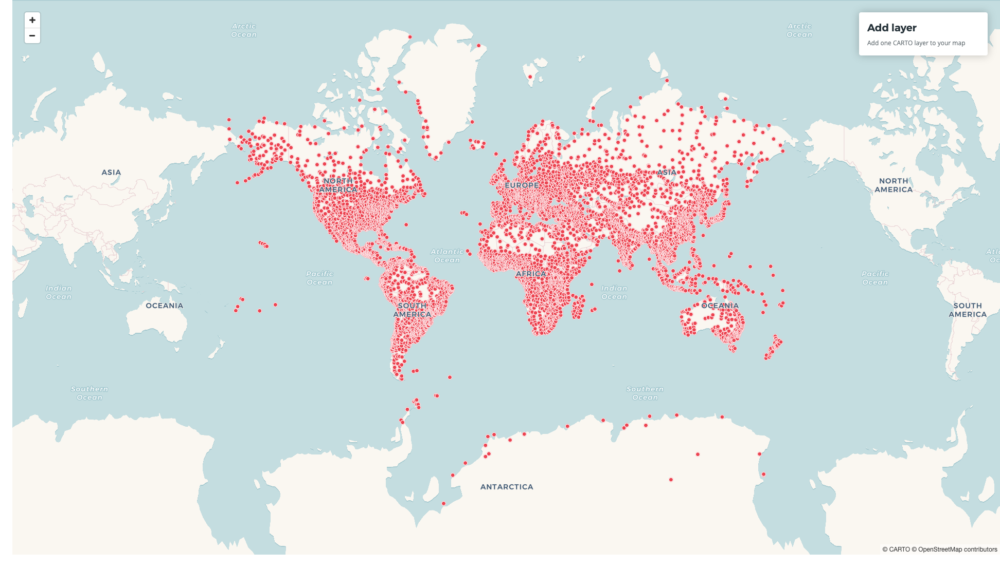
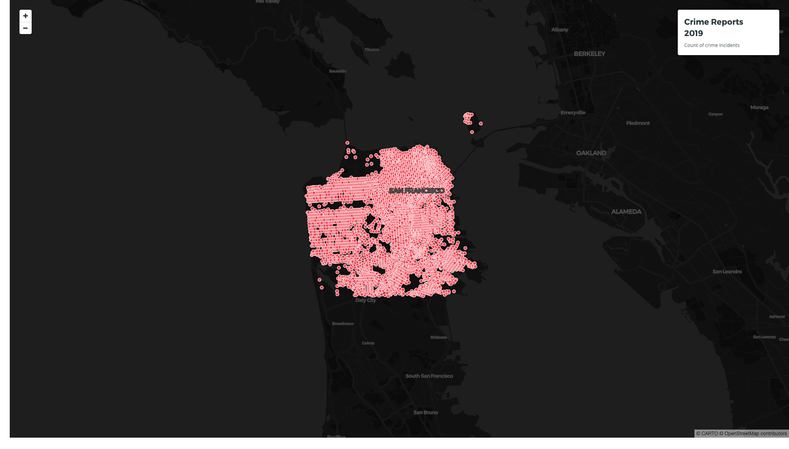
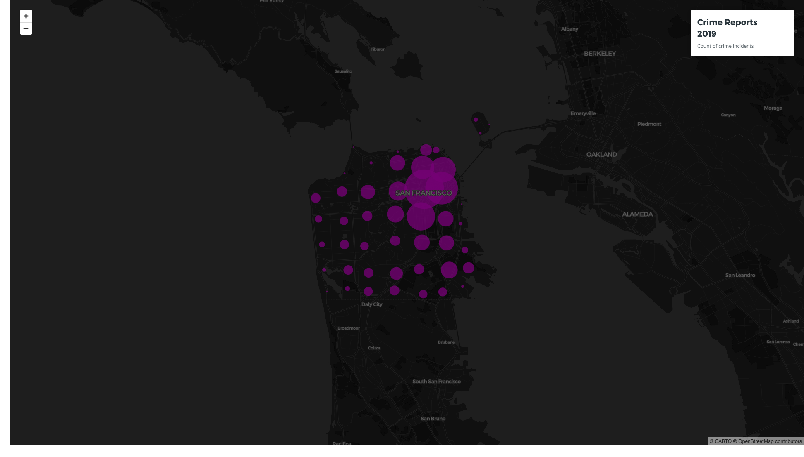
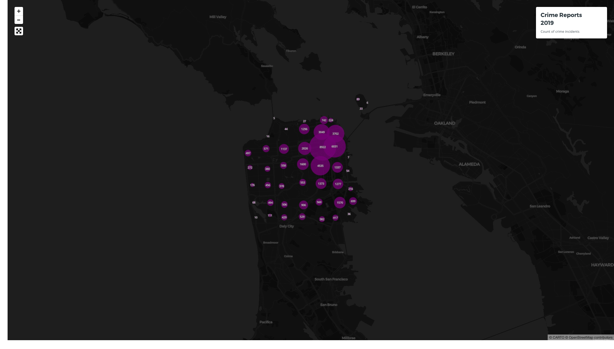
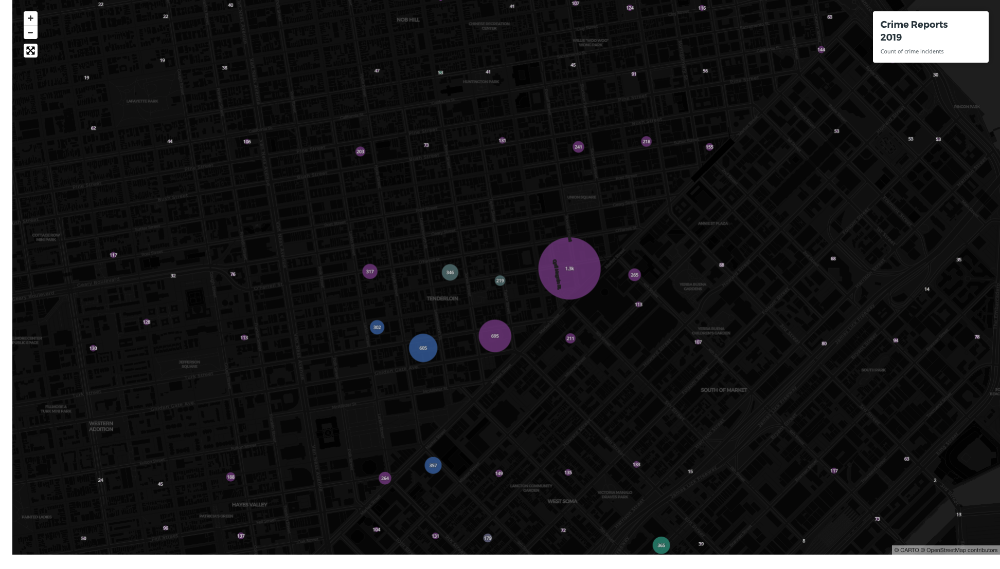

# Steps

## 1. Create the basic structure from an example

* [CARTO VL examples](https://carto.com/developers/carto-vl/examples/)
* [Source](step-1.html)



## 2. Add your credentials and change settings

* [Credentials guide]()
* [Source](step-2.html)

Notes:
- We have changed the basemap to `darkmatter`



## 3. Style by using cluster count

* [clusterCount Expression](https://carto.com/developers/carto-vl/reference/#cartoexpressionsclustercount)
* [Source](step-3.html)

Notes:

- We use `sqrt(@cluster_count)` in order to decrease each feature size proportionally.
- Try change the resolution value and see what happens.
- Let's change the styles: remove the stroke, change the color, add opacity.



## 4. Add labels using Mapbox

* [Points labels CARTO VL example](https://carto.com/developers/carto-vl/examples/#example-point-labels)
* [Label Cluster Count](https://carto.com/developers/carto-vl/examples/#example-label-cluster-counts)
* [Mapbox label documentation](https://docs.mapbox.com/mapbox-gl-js/example/display-and-style-rich-text-labels/)
* [Source](step-4.html)



Notes:
- First, let's use the viewport features expression to get the cluster count of each cluster feature present in the viewport
- Second, copy the code from the Label Cluster Count example above to set up the labels layer when the layer is loaded
- Understand the filter
- Zoom in, out to see how it changes

## 5. Use clusterMode expression to color the clusters

* [clusterMode expression](https://carto.com/developers/carto-vl/reference/#cartoexpressionsclustermode)

Notes:
- If we would like to change the width depending on the `$incident_category` column instead of the cluster count, we would have to use it along with `clusterMode` because it has been already aggregated.
- Filter labels: string vs number



## 6. Visualize incidents by day using an interactive based filter

* [Interactive based filter CARTO VL example](https://carto.com/developers/carto-vl/examples/#example-interactive-based-filter)

```html
<section>
  <div id="controls">
    <ul id="content"></ul>
  </div>
</section>
```

## 7. Use a dropdown to select categories